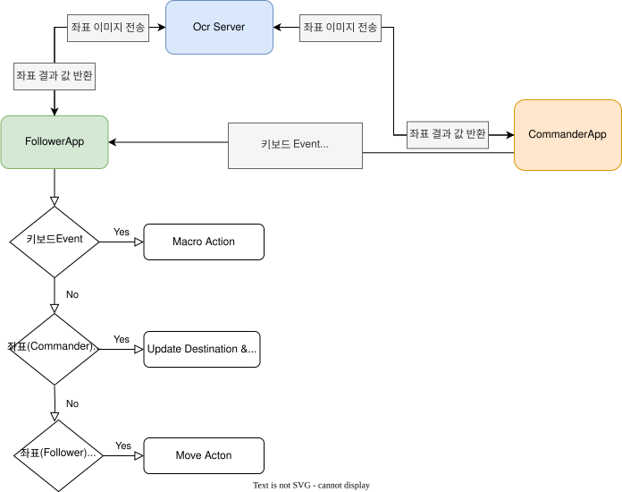

# [Compose Multiplatform](https://github.com/JetBrains/compose-multiplatform) desktop application

> **Note**
> If you have any issues, please report them on [GitHub](https://github.com/JetBrains/compose-multiplatform/issues).
* [Learn about other cases for using the Compose Multiplatform UI framework](https://github.com/JetBrains/compose-multiplatform#readme)
* [Create an application targeting iOS and Android with Compose Multiplatform](https://github.com/JetBrains/compose-multiplatform-ios-android-template#readme)
* [Complete more Compose Multiplatform tutorials](https://github.com/JetBrains/compose-multiplatform/blob/master/tutorials/README.md)
* [Explore more advanced Compose Multiplatform example projects](https://github.com/JetBrains/compose-multiplatform/blob/master/examples/README.md)

## 스킬 쿨타임 / 버프 OCR 모니터
우상단 검은 박스(스킬 쿨타임)와 우측 버프 패널(호체주술 49초 / 보호 178초 ...)을 읽어서 보여준다.

1. `script/run_ocr_server.bat` 로 OCR 서버를 띄운다 (처음 한 번은 venv를 만들고 CPU용 torch를 설치한다).
   CPU 스레드 수는 `OCR_THREADS` 환경변수로 정한다 (기본 2).
2. `script/run_ocr_monitor.bat` (또는 `gradlew run -PmainClass=OcrMonitorKt`) 로 모니터를 띄운다.
3. 게임 창(제목에 `옛날바람`이 들어간 창)을 직접 캡처한다. 다른 창에 가려져도 되고, 창을 옮겨도 된다.
4. 각 영역의 **영역 지정** 버튼을 누르고 게임 화면에서 드래그한다. 영역은 게임 창 대비 비율로
   `~/.baram_macro/ocr_settings.json` 에 저장돼서 창 크기가 바뀌어도 따라간다.

OCR 서버가 다른 PC에 있으면 `OCR_HOST` 환경변수로 주소를 바꾼다 (기본 `192.168.0.2`).
인식 확인은 `script` 폴더에서 `python test_timer_ocr.py`.

## Diagram

## Screenshots
it will be later

## Libraries
* Detect text: [EasyOCR](https://github.com/JaidedAI/EasyOCR)
* Network: [Ktor](https://github.com/ktorio/ktor)
* Keyboard Event: [JNativeHook](https://github.com/kwhat/jnativehook)

